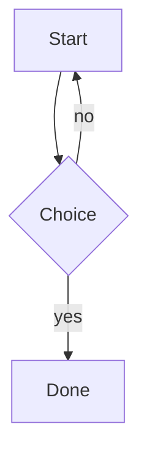

# Mermaid and math

A diagram:

```mermaid
graph TD
  A[Start] --> B{Choice}
  B -->|yes| C[Done]
  B -->|no| A
```

An inline formula $E = mc^2$ inside a sentence.

A block formula:

$$
\int_0^1 x^2 \, dx = \frac{1}{3}
$$

The end.
